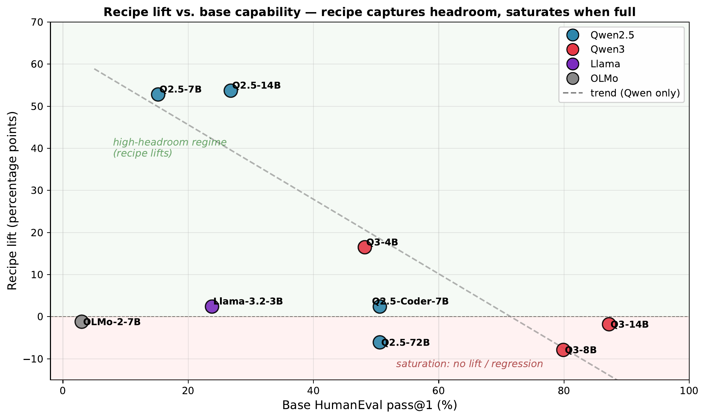
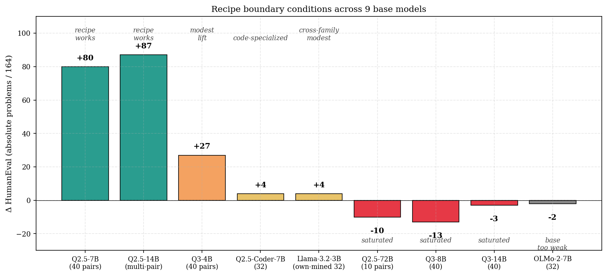

# TinyForge-Zero

**Self-bootstrapping recipes for open base LLMs — no human-written training data.**

A 14B open base model reaches **80% on HumanEval** and **74.4% on HumanEval+** with only a Python interpreter as oracle and no human-curated training data, for under **$5** of consumer-GPU compute. This repo contains the recipes, mined pairs, evaluation scripts, and adapters from the paper.

📄 **Paper**: *How Far Can an Open Base Model Self-Improve? Recipes, Limits, and Test-Time Synergy* — arXiv link forthcoming
📦 **Companion to**: `ranausmanai/tinyforge` (earlier exploratory experiments)

---



## Headline results

| Model | Setting | Base | After recipe | Δ |
|-------|---------|-----:|-------------:|--:|
| Qwen2.5-14B-Base | HumanEval (chat-template) | 44/164 (26.8%) | **131/164 (79.9%)** | **+53.0pp** |
| Qwen2.5-14B-Base | HumanEval+ | — | **122/164 (74.4%)** | — |
| Qwen2.5-7B-Base | HumanEval (best seed) | 25/164 (15.2%) | **112/164 (68.3%)** | **+53.0pp** |
| Qwen2.5-3B-Base | GSM8K (auto-difficulty curriculum) | 32/100 | **66/100** | **+34pp** |
| Random external pairs | HumanEval (control) | 25 | 25 | **+0** |

All numbers from `result.json` files in this repo's accompanying paper data. Same adapter under the multi-pair run's eval format reads **132/164 (80.5%)** — both round to 80%.

---

## The recipe in one diagram

```
┌──────────────────────────────────────────────────────────────────────┐
│  (1) PROBLEM GEN     Base model emits Python function + 3 asserts.   │
│                      Keep only problems where the canonical passes.  │
│                                                                      │
│  (2) DIVERSE SOLVE   Resample 4–8 attempts at T=0.7–0.8.             │
│                      Run each against the asserts.                   │
│                                                                      │
│  (3) PAIR MINING     If some pass and some fail → (broken, fixed)    │
│                      pair. Skip if all-pass (too easy) or all-fail   │
│                      (above competence).                             │
│                                                                      │
│  (4) LoRA TRAIN      Fine-tune (rank 16–32, q/k/v/o) on the pairs.   │
│                      2 epochs, lr=1e-4. No human data, no RL.        │
│                                                                      │
│  (5) EVALUATE        HumanEval / HumanEval+ / MBPP / GSM8K.          │
└──────────────────────────────────────────────────────────────────────┘
```

A control experiment — replacing the mined pairs with **identically-formatted but randomly-corrupted external pairs** — yields **exactly +0**. The signal is in the self-mined content, not the training-data format.

---

## What's in this repo

```
tinyforge-zero/
├── recipe/
│   ├── train_on_pairs.py       # Fast-path: train LoRA on a released pairs.jsonl
│   ├── bootstrap.py            # Full-path: self-bootstrap pipeline (mining + train, 7B / 3B)
│   ├── multi_pair_14b.py       # Full-path: aggressive multi-pair variant → 80.5% on 14B
│   ├── curriculum_math.py      # Full-path: auto-difficulty curriculum for GSM8K
│   ├── eval_raw.py             # HumanEval / MBPP / GSM8K eval (vLLM, raw-completion)
│   ├── eval_plus.py            # HumanEval+ contamination-resistant eval
│   └── confirm.py              # Confirmation re-eval against base
├── data/
│   ├── pairs_7b_40.jsonl              # 40 self-mined pairs (Qwen2.5-7B-Base run)
│   ├── pairs_14b_multi_new60.jsonl    # 60 aggressive-mined pairs for 14B (+ warmup 40 → 100 total)
│   └── pairs_math_13.jsonl            # 13 curriculum-mined math pairs (Qwen2.5-3B-Base → GSM8K 32→66)
├── controls/
│   └── mbpp_corrupt_control.py # The +0 negative-control experiment
├── docs/
│   ├── scaling_chart.png       # Recipe lift vs base capability (paper Fig 1)
│   ├── fig1_headline.png       # Headline result chart
│   └── fig6_boundary.png       # Boundary conditions across 9 models
├── REPRODUCE.md                # Paper figure/table → exact command mapping
├── requirements.txt
└── LICENSE
```

---

## Quickstart

```bash
# 1. Clone
git clone https://github.com/ranausmanai/tinyforge-zero.git
cd tinyforge-zero

# 2. Install (Python 3.10+, CUDA 12.1+, GPU with ≥40GB VRAM recommended)
pip install -r requirements.txt

# 3. Baseline the model (so you know the lift is real)
python recipe/eval_raw.py \
    --model Qwen/Qwen2.5-7B \
    --bench humaneval

# 4. Train on the released 40 mined pairs (~10 min on H100)
python recipe/train_on_pairs.py \
    --model Qwen/Qwen2.5-7B \
    --pairs data/pairs_7b_40.jsonl \
    --epochs 2 --lr 1e-4 --lora-rank 16 \
    --out adapter_7b --seed 13

# 5. Evaluate the trained adapter
python recipe/eval_raw.py \
    --model Qwen/Qwen2.5-7B \
    --adapter adapter_7b \
    --bench humaneval
```

Expected outcome: HumanEval moves from ~25/164 to **~95–112/164** (seed-dependent).

For the **14B → 80.5%** run, use `recipe/multi_pair_14b.py` with both `data/pairs_7b_40.jsonl` (warmup) and `data/pairs_14b_multi_new60.jsonl`. See [REPRODUCE.md](REPRODUCE.md) for the exact command and expected hardware.

---

## Boundary conditions (where the recipe fails)



The recipe works under stated conditions. We document four failure modes:

1. **Saturation**: Qwen3-8B/14B-Base and Qwen2.5-72B-Base have so little headroom on HumanEval that mining produces zero or negative lift.
2. **Distribution mismatch**: Pairs mined on simple problems do not transfer to BigCodeBench-Hard (library code) or MATH-500 (competition math). Catastrophic when ignored — see the over-correction case (Qwen3-4B MATH-500 dropped 299 → 69).
3. **Base capability floor**: OLMo-2-7B at 5/164 baseline produces too few "fix" attempts to mine from.
4. **Self-correction trained on wrong→fix only**: model over-doubts and degrades on correct outputs. Mixing right→stays-right traces recovers it.

See the paper's §3 for measurements; the boundary chart above shows the recipe's lift across all 9 base models we tested.

---

## Adapters

The LoRA adapter weights for the headline 14B run (the 80.5% adapter) are ~200 MB and are not committed to this repo. They live separately:

- **Hugging Face Hub**: `ranausmanai/tinyforge-zero-qwen25-14b-lora` *(upload pending — for now, request access via GitHub Issues)*
- **Local mirror used in the paper**: `/Users/usman/tinyforgeexperiment/results/multi_pair/multi_v1/adapter/`

The adapter is a standard `peft` LoRA over `Qwen/Qwen2.5-14B`. Load with:

```python
from peft import PeftModel
from transformers import AutoModelForCausalLM, AutoTokenizer

base = AutoModelForCausalLM.from_pretrained("Qwen/Qwen2.5-14B", torch_dtype="bfloat16")
model = PeftModel.from_pretrained(base, "ranausmanai/tinyforge-zero-qwen25-14b-lora")
tok = AutoTokenizer.from_pretrained("Qwen/Qwen2.5-14B")
```

---

## Hardware used in the paper

| Run | GPU | Time | Cost |
|-----|-----|------|------|
| Qwen2.5-7B 40-pair recipe | RTX 6000 Ada | ~30 min | <$1 |
| Qwen2.5-14B multi-pair (80.5%) | 1× H100 80GB | ~95 min | ~$3.50 |
| Qwen2.5-3B GSM8K curriculum | RTX 6000 Ada | ~30 min | <$1 |
| Full eval suite (9 models, HE+HE++MBPP) | 1× H100 | ~3 hrs | ~$8 |

All runs were on rented consumer/cloud GPUs (RunPod). Total spend documented in the paper was under $50.

---

## Citation

```bibtex
@misc{usman2026tinyforgezero,
  title  = {How Far Can an Open Base Model Self-Improve?
            Recipes, Limits, and Test-Time Synergy},
  author = {Rana Usman},
  year   = {2026},
  eprint = {TBD},
  archivePrefix = {arXiv},
  primaryClass = {cs.AI}
}
```

---

## License

MIT — see [LICENSE](LICENSE). The mined pairs in `data/` are derivatives of base-model outputs (Qwen2.5 family, Apache-2.0). Treat downstream redistribution accordingly.

---

## Contact

- Issues / questions: [GitHub Issues](https://github.com/ranausmanai/tinyforge-zero/issues)
- Email: usmanashrafrana@gmail.com
